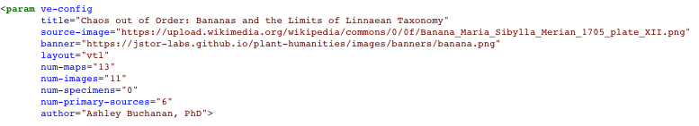

# The Parts of an Essay

While not all essays written for print are the same, they usually share some, if not all, of these parts:

* A Title
* An Author
* A description or abstract
* Sections
* Paragraphs
* Footnotes/Endnotes/References

Those parts can also be found in visual essays, but visual essays have additional parts that authors must construct such as:

* Images and Image Galleries
* Maps and Layers
* Linked Open Data
* Network Graphs

To make these new features possible, a visual essay relies on some level of coding that describes for readers what should appear on the screen at any given time. Our goal in creating the Visual Essay Tool has been to balance the performative possibilities of your essay with the complexity of code. In doing so, we have sought to make the technical hurdle of writing code as accessible as possible, preferring to hide messy details that are likely to be prove unproductive. At the same time, we have sought to expose the capabilities of the code when we recognize they could very helpful for making visual arguments. We learn this from the authors themselves as they write their essays. So if you feel like you wish your essay be customized just a little more, please reach out!

The structure of a visual essay is similar to a traditional printed essay with some key differences. First, it begins with a basic configuration tag that specifies some basic information about how to display the essay to readers.

# The Configuration Tag

The `param ve-config` tag is not technically required for an essay to render, but it supplies crucial information that any serious essay would include. The form of the configuration tag is:

`<param ve-config attribute1="value for this attribute">`

Note that the tag begins with a left caret (<) and ends with a right caret after the final attribute (>). It can contain multiple attribute/value pairs. Each attribute can be spaced out on a single line, but they are often clearer when formed into a vertical list like so:

The value for a given attribute is always enclosed in double quotations marks ("). In this example we can see the following *attributes* are defined for this essay:

|Attribute|Description of the value|Effect for Readers|
|---|---|---|
|title|The title of your essay|Displayed at the top of your essay|
|banner|The URL of your banner image|Displayed at the top of your essay|
|layout|Specify a vertical essay with `vtl`|Your essay will use a vertical orientation|
|num-maps|The number of maps in your essay|Displayed at the top of your essay|
|num-images|The number of images in your essay|Displayed at the top of your essay|
|num-primary-sources|The number of primary sources in your essay|Displayed at the top of your essay|
|author|That's probably you!|Displayed at the top of your essay|

# Linked Open Data Tags

