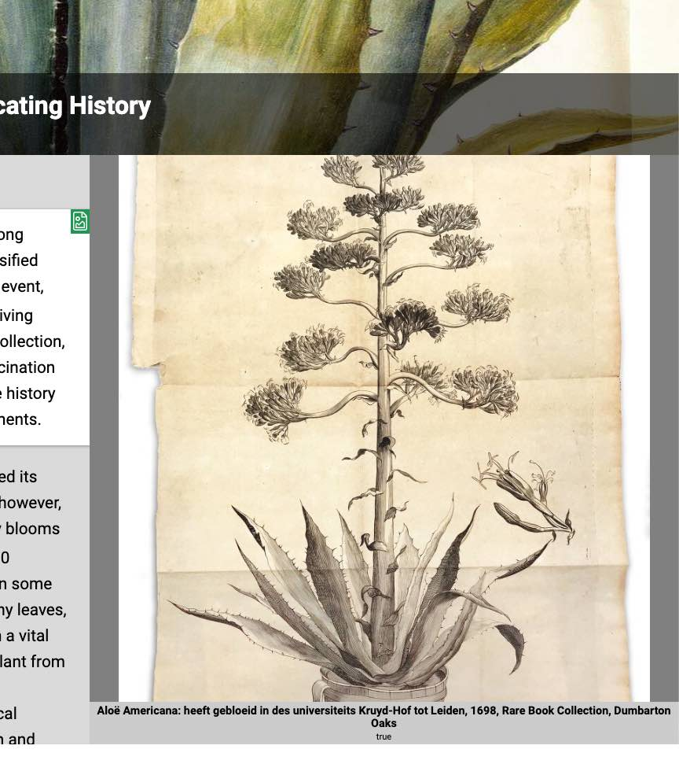

# Image viewer

## Overview

{: .right .dropshadow .border .thumb-300w} 

The image viewer is used to display high-resolution images with interactive zooming and panning.  Images are rendered in a custom IIIF viewer that provides many options for image display and interaction, including a guided tour capability using annotations.

## Options

- __url__:  The URL to the source version of the image.
- __manifest__:  The URL to the IIIF presentation manifest for the image, if one exists.
- __label__:  The label attribute is used for the image caption.  Markdown text formatting is supported in the title allowing for italicized and bold text.
- __description__:  If a label is not provided the attribute is used for the image caption.  Markdown text formatting is supported in the title allowing for italicized and bold text.
- __attribution__:  An attribution statement to associate with the image.
- __license__:  
- __fit__:  This attribute defines how an image will be scaled or cropped in the image viewer window.  Possible values for this attribute are
    -  `contain`:  The replaced content is scaled to maintain its aspect ratio while fitting within the element's content box
    -  `cover`:  (default) The replaced content is sized to maintain its aspect ratio while filling the element's entire content box. The object will be clipped to fit
- __rotate__:  
- __region__:  The region attribute is used to show a cropped region of the image in the image viewer.  The entire image is loaded and can be seen by zooming and panning but the initial display will only include the specified region.  The value for a region is a comma separated sequence of 4 integers representing the origin, width and height.  The origin includes both the x and y coordinates relative to the top left of the image.  The region may be expressed as absolute pixel values or as percentages of the relative values.  More information on IIIF regions can be found at [https://iiif.io/api/image/2.0/#region](https://iiif.io/api/image/2.0/#region)
- __layers__:  
- __curtain__:  
- __compare__:  

### Interactions

- __zoomto__:  The `zoomto` action takes a comma-delimited value defining the image region to be displayed in the viewer.  The value is the same as defined in the `region` attribute above.

Below is an example `zoomto` action for a `click` event:  
```html 
	<span data-click-image-zoomto="100,100,1000,1000">Foo</span>
```

## Usage examples
